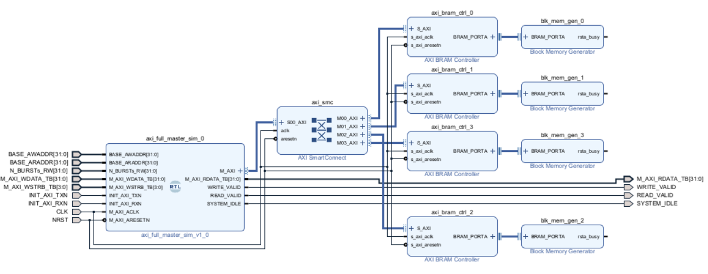

# axi_full_tester
this file contains a tester for an axi full with the core for the test and a example test bench

***MARK -> 99%***
Tested with vivado and brams and isolated simulations

```
files:
    example_tb.vhd -> use example test bench
    axi_full_master_sim.vhd -> IP for debug
```


IP tester BD example:


