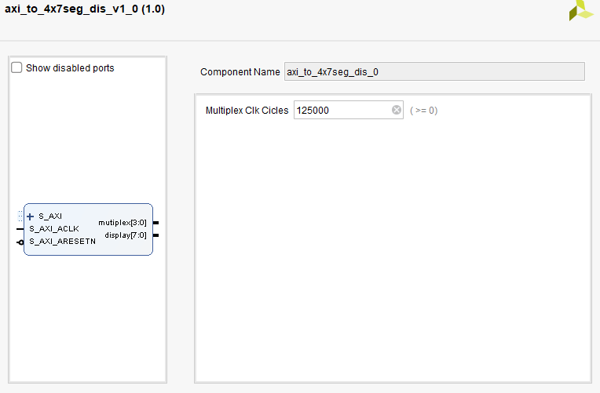

# AXI to 4x7 segments display IP
This file contains a IP for an axi slave to 4x7 segments display.<br>
<br>

### IP:


***MARK -> 99%***
Tested with TB and a zynq with vitis

### REGISTER MAP
|    OFSET     | USE |
|--------------|--------------|
| 0x00000      | DATA TO BE DISPLAYED      |
| 0x00004      | MODE OF WORKING      |

### DATA TO BE DISPLAYED

Working mode RAW

| 7 to 0     | Display0 Dp-G-F-E-D-C-B-A|
|------------|---------------|
| 15 to 8    | Display1 Dp-G-F-E-D-C-B-A|
|------------|---------------|
| 23 to 16   | Display2 Dp-G-F-E-D-C-B-A|
|------------|---------------|
| 31 to 24   | Display3 Dp-G-F-E-D-C-B-A|
|------------|---------------|

Working mode DECODE

| 7 to 0     | Display0 HEX num|
|------------|---------------|
| 15 to 8    | Display1 HEX num|
|------------|---------------|
| 23 to 16   | Display2 HEX num|
|------------|---------------|
| 31 to 24   | Display3 HEX num|
|------------|---------------|

### MODE OF WORKING 

| 0     | 1 RAW 0 DECODE|
|------------|---------------|
| 8    | 1 RAW 0 DECODE|
|------------|---------------|
| 16   | 1 RAW 0 DECODE|
|------------|---------------|
| 24   | 1 RAW 0 DECODE|
|------------|---------------|

```
Files:
axi_to_4x7seg_dis.vhd -> IP
vitis.c -> TB
```

<br>
