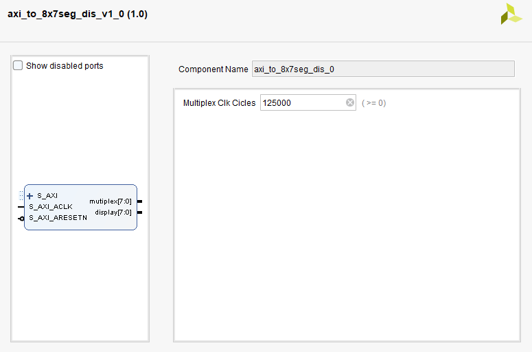

# AXI to 8x7 segments display IP
This file contains a IP for an axi slave to 8x7 segments display.<br>
<br>

### IP:


***MARK -> 99%***
Tested with TB and a zynq with vitis

### REGISTER MAP
|    OFSET     | USE |
|--------------|--------------|
| 0x00000      | DATA TO BE DISPLAYED LOW     |
| 0x00004      | MODE OF WORKING   LOW   |
| 0x00008      | DATA TO BE DISPLAYED HIGHT     |
| 0x0000C      | MODE OF WORKING   HIGHT   |

### DATA TO BE DISPLAYED LOW / HIGHT

Working mode RAW

| bits  7 to 0     | Display0 Dp-G-F-E-D-C-B-A|
|------------|---------------|
| bits  15 to 8    | Display1 Dp-G-F-E-D-C-B-A|
| bits  23 to 16   | Display2 Dp-G-F-E-D-C-B-A|
| bits  31 to 24   | Display3 Dp-G-F-E-D-C-B-A|


Working mode DECODE

| bits 7 to 0     | Display0 HEX num|
|-----------------|---------------|
| bits 15 to 8    | Display1 HEX num|
| bits 23 to 16   | Display2 HEX num|
| bits 31 to 24   | Display3 HEX num|

### MODE OF WORKING LOW / HIGHT

| bit 0    | Display0 1 RAW 0 DECODE|
|-------------------------|---------------|
| bit 8    | Display1 1 RAW 0 DECODE|
| bit 16   | Display2 1 RAW 0 DECODE|
| bit 24   | Display3 1 RAW 0 DECODE|

```
Files:
axi_to_8x7seg_dis.vhd -> IP
vitis.c -> TB
```

<br>
