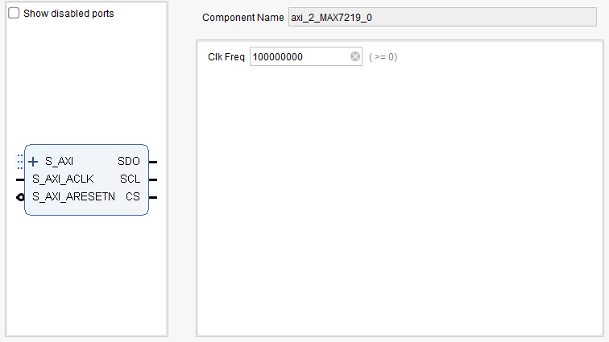

# AXI to MAX7219 IP
This file contains a IP for an axi slave to MAX7219.<br>
<br>

### IP:


***MARK -> 99%***
Tested with TB and a zynq with vitis

### REGISTER MAP
|    OFSET     | USE |
|--------------|--------------|
| 0x00000      | CMD TO SEND      |
| 0x00004      | IP READY      |

### CMD TO SEND

| 15 to 0     | CMD TO SEND TO MAX7219|
|------------|---------------|

### IP READY 

| 0     | IP READY 1 bussy 0|
|------------|---------------|


```
Files:
    axi_2_MAX7219.vhd -> IP
    axi_master_interface_controller.vhd -> stuf for vhdl TB
    design_top.vhd -> stuf for vhdl TB
    design_top_tb.vhd -> stuf for vhdl TB
    master_axi_base_top.vhd -> stuf for vhdl TB
    vitis.c -> c TB
```

<br>


