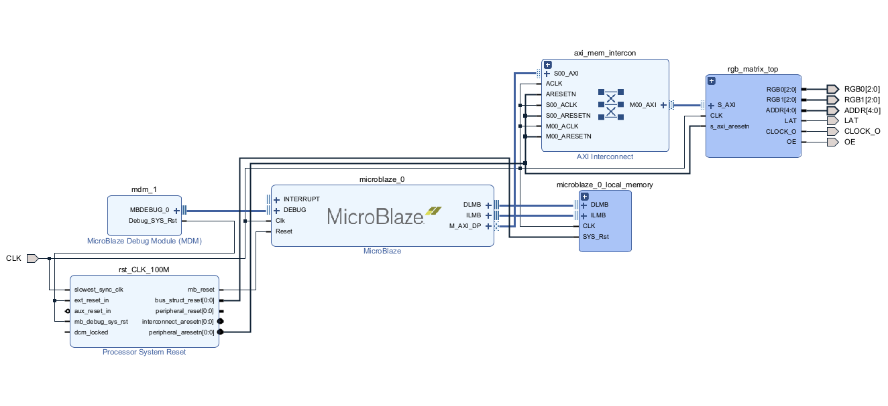
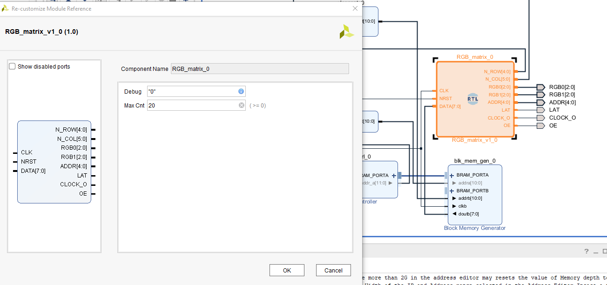

# AXI to RGB Matrix
This file contains a IP for an axi slave to MAX7219.<br>
<br>

***MARK -> 99%***
Tested with TB and a zynq with vitis

### HOW TO BUILD THE IP:


### EXAMPLE SYSTEM:


### CUSTOMZING THE IP:


```
Files:
    constrains_nexysA7.xdc => constrains_nexysA7
    RGB_matrix.vhd => ip to be integrated
    RGB_matrix_tb.vhd => tb
    vitis.c => example use
```

<br>
