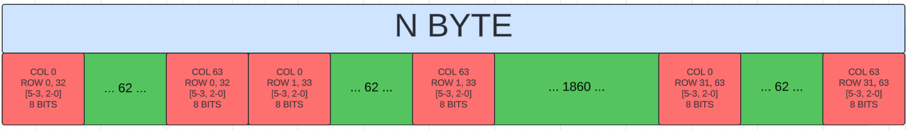
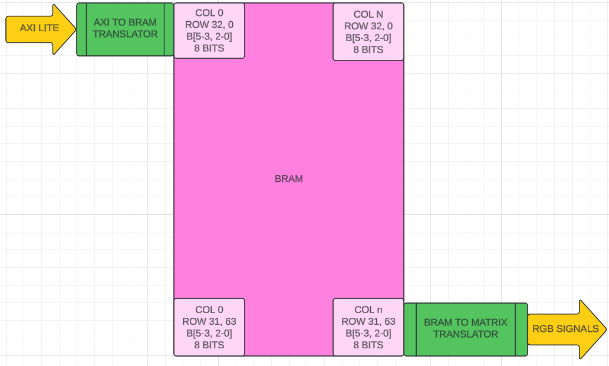

# AXI to RGB Matrix
This file contains a IP for an axi slave lite to RGB Matrix.<br>
<br>

***MARK -> 99%***
Tested with TB and a zynq with vitis

### MEMORY MAP:


### BLOCK DIAGRAM:


CLK_DIV = clk divider => f_clk/max_cnt = CLock_O
debub = '1' shows a pattern
debub = '0' normal use

```
Files:
    constrains_nexysA7.xdc => constrains_nexysA7
    RGB_matrix_tb.vhd => tb
    vitis.c => example use => vitis use and tb
    axi_lite_to_bram.vhd => transaltor from axi to bram addres
    axi_to_rgb_matrix.vhd => top IP
    bram.vhd => bram
    RGB_matrix.vhd => translator form bram addres to matrix rgb signals
    tools/draw_tool => python screept for drawing in the screen
```

<br>