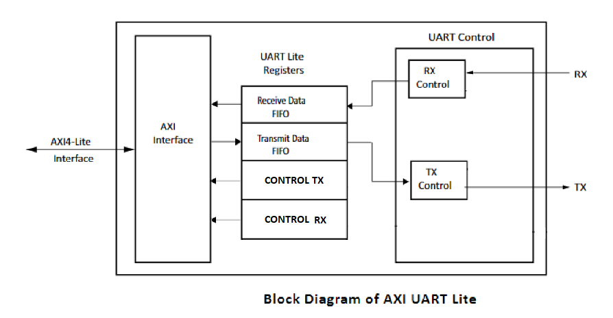

# AXI to UART IP
This file contains a IP for an axi slave to UART.<br>
<br>

### IP:


***MARK -> 99%***
Tested with TB and a zynq with vitis

### REGISTER MAP
|    OFSET     | USE |
|--------------|--------------|
| 0x00000      | FIFO TX      |
| 0x00004      | CONTROL TX      |
| 0x00008      | FIFO RX     |
| 0x0000C      | CONTROL RX      |

### CONTROL TX

| bit  0     | FIFO TX EMPTY = 1|
|------------|---------------|
| bit  1     | FIFO TX FULL = 1|

### CONTROL RX 

| bit 0      | FIFO RX EMPTY = 1|
|------------|---------------|
| bit  1     | FIFO RX FULL = 1|


```
Files:
    axi_lite_uart.vhd => top of the uart IP
    axi_master_interface_controller.vhd =>  stuf for vhdl TB
    doc.pdf => PDF documentation
    fifo.vhd => fifo for tx and rx for uart IP
    master_axi_base_top.vhd => stuf for vhdl TB
    top_design_tb.vhd => stuf for vhdl TB
    top_design_uart_test.vhd => stuf for vhdl TB
    uart.vhd => uart fisical interface for uart IP
    uart_tb.vhd => stuf for vhdl TB
    vitis.c => vitis TB and use example
```
[DOC](doc.pdf)
<br>


