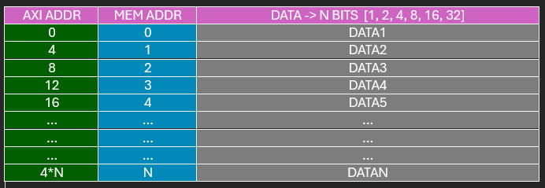

# axi_lite_to_bram
this file contains a axi_lite_to_bram for generate new ips

***MARK -> 99%***
Tested with vivado and brams and isolated simulations

```
files:
    axi_lite_to_bram.vhd -> AXI TO BRAM TRANSLATE
    bram.vhd -> BRAM
```

The mem addres ip de bram is in jumps of 4 addres of the AXI map.
Example:

REGISTER MAP:
