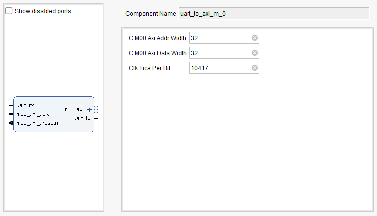

# UART to AXI IP
This file contains an IP for a UART to AXI master. 

### IP:

 
***MARK -> 99%***
Tested with TB and a Zynq with Vitis
 
### WRITE TO AXI EX

| ADDRESS       | R/W   | data UART TX                |
|---------------|--------|------------------------------|
| 32 bits       | 8 bits | 32 bits                     |
| 0xC1200000    | 0x00   | 🔴 0xDEADBEEF |

### READ FROM AXI EX

| ADDRESS       | R/W   | data UART RX                |
|---------------|--------|------------------------------|
| 32 bits       | 8 bits | 32 bits                     |
| 0xC1200000    | 0x01   | 🔵 0xDEADBEEF |
