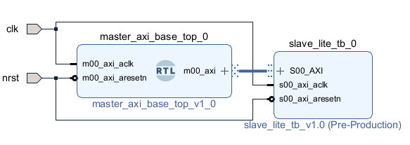

This folder contains a base for the AXI Master Lite interface from which different IPs can be created. 
The folder also contains a testbench that consists of the interconnection of an AXI Master and an AXI Slave to test the traffic and ensure the correct functionality of the IP.

